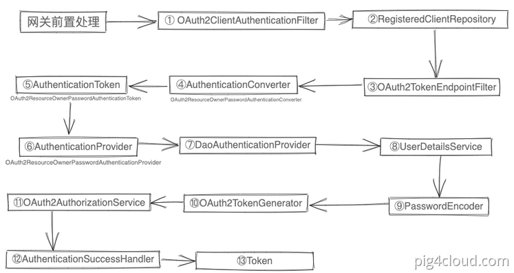
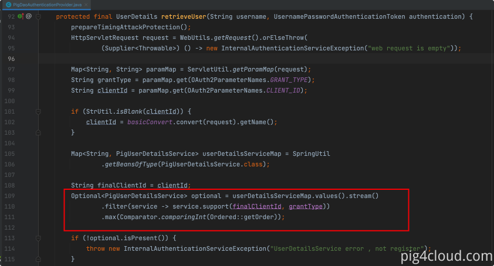
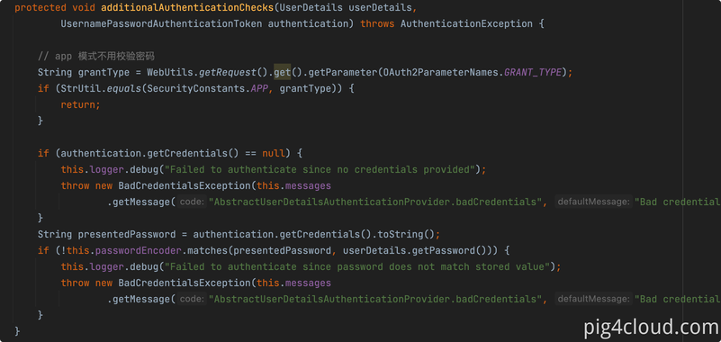
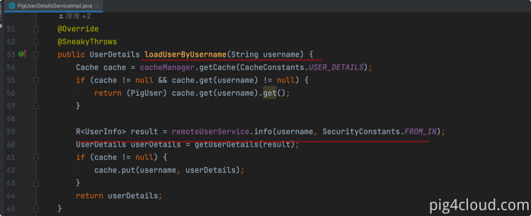
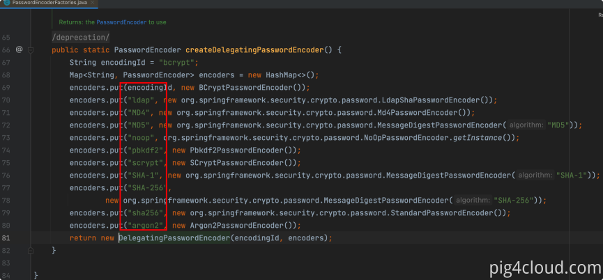
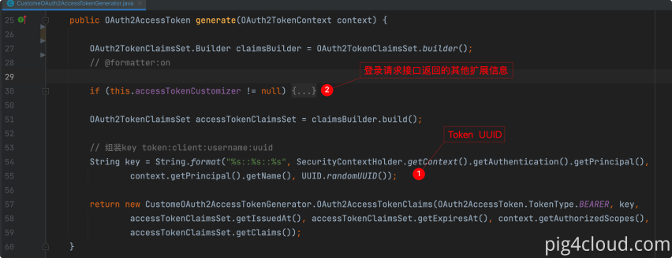
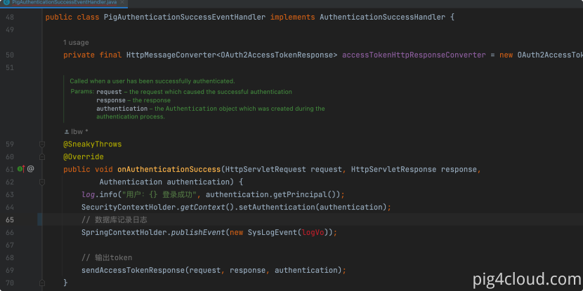

# 包介绍
* config 授权服务的自动装配
* endpoint 开放的和token有关的restful接口
* support 对用户密码，短信等认证的封装，继承自org.springframework.security包下面的接口和基类
  * AuthenticationConverter 自定义模式认证转换器
  * AuthenticationProvider 处理自定义授权
  * OAuth2ResourceOwnerBaseAuthenticationToken 自定义授权模式抽象
# 登录
* 启动至少pigAuth和pigAdmin两个项目，因为pigAuth再获取用户信息时需要用到pigAdmin
* postman上密码登录 
/oauth2/token
```
Header:Authorization    Basic cGlnOnBpZw==  //base64(client_id:client_secret)
POST:x-www-form-urlencode
    username:admin
    password:123456
    grant_type:password
    scope:server
```
响应结果
```json
{
    "sub": "admin",
    "clientId": "pig",
    "iss": "https://pig4cloud.com",
    "token_type": "Bearer",
    "access_token": "pig::admin::e661f866-b686-47d5-91de-2615b5597f18",
    "refresh_token": "NL7xqt4lKR9ffN4VMQBXYLW77_YOQI3kYFvZJDm7Je1aSRoM94QL0EOVa5PkCM2DSsxjJpoHanJxqL5DCIesORCk7-DZqBWdl5v6NxDWZhaTkJBE3D9LxJ80yRDcs-pa",
    "aud": [
        "pig"
    ], 
    "license": "https://pig4cloud.com",
    "nbf": 1661751589.017000000,
    "user_info": {
    "password": null,
    "username": "admin",
    "authorities": [
    {
    "authority": "ROLE_1"
    }]
    },
      "scope": [
        "server"
      ],
      "exp": 1661794789.017000000,
      "expires_in": 43200,
      "iat": 1661751589.017000000,
      "jti": "90b59efd-e1d2-4f4d-a0e5-53daefae9aa2"
    }
```
# 不同client_id使用不同的登录方式
* 添加头Authorization Basic base64(client_id:client_secret)


# token解析

# 登录请求报文
```
POST /auth/oauth2/token?grant_type=password&scope=server HTTP/1.1
Host: pig-gateway:9999
Authorization: Basic dGVzdDp0ZXN0
Content-Type: application/x-www-form-urlencoded
Content-Length: 32
username=admin&password=YehdBPev
```
# auth服务认证过程
## 1 网关前置处理
* 验证码校验    ValidateCodeGatewayFilter.jav
* 前端已加密的密码进行解密    PasswordDecoderFilter.java ， 主要就是把如下图的 password 密文转成明文交由 SpringSecurity处理
  

## 2 客户端认证处理

如上图在登录请求中会携带 Basic base64(clientId:clientSecret)， 那么首先OAuth2ClientAuthenticationFilter 会通过调用 RegisteredClientRepository  (数据库存储) 来判断传入的客户端是否正确
## 3正式接收登录请求
OAuth2TokenEndpointFilter 会接收通过上文 OAuth2ClientAuthenticationFilter 客户端认证的请求


## 4 组装认证对象
AuthenticationConverter  会根据请求中的参数和授权类型组装成对应的授权认证对象


## 5登录认证对象
```
public class XXXAuthenticationToken extends OAuth2ResourceOwnerBaseAuthenticationToken {

}
```


## 6授权认证调用


## 7核心认证逻辑


## 8 多用户体系匹配 UserDetailsService


## 9 密码匹配校验


## 10 用户状态校验


## 11 用户查询逻辑

用户查询逻辑的多种实现形式
● 解耦： 通过feign 查询其他系统获取并组装成 UserDetails
● 简单:    认证中心直接查询DB 并组装成 UserDetails


## 12 密码校验逻辑


```
默认支持加密方式如下：

{noop}密码明文
{加密特征码}密码密文

PasswordEncoder 会自动根据特征码匹配对应的加密算法，所以上一步⑧ 查询用户对象组装成  UserDetails 需要特殊处理

//UserDetails
return new UserDetails(user.getUsername(),"{bcrypt}"+"数据库存储的密文");
```
## 13 生成OAuth2AccessToke


## 14 Token 存储持久化

当前SAS 仅支持 JDBC 和内存 ，PIG 扩展支持Redis 实


## 15登录成功事件处


## 16 请求结果输出Toke
```
private void sendAccessTokenResponse(HttpServletRequest request, HttpServletResponse response,
			Authentication authentication) throws IOException {

		OAuth2AccessTokenAuthenticationToken accessTokenAuthentication = (OAuth2AccessTokenAuthenticationToken) authentication;

		OAuth2AccessToken accessToken = accessTokenAuthentication.getAccessToken();
		OAuth2RefreshToken refreshToken = accessTokenAuthentication.getRefreshToken();
		Map<String, Object> additionalParameters = accessTokenAuthentication.getAdditionalParameters();
		// 无状态 注意删除 context 上下文的信息
		SecurityContextHolder.clearContext();
		this.accessTokenHttpResponseConverter.write(accessTokenResponse, null, httpResponse);
	}
```
## 17定义具体的输出返回格式等逻


