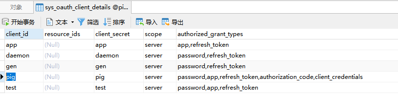

# 登录
* 启动至少pigAuth和pigAdmin两个项目，因为pigAuth再获取用户信息时需要用到pigAdmin
* postman上密码登录 
/oauth2/token
```
Header:Authorization    Basic cGlnOnBpZw==
POST:x-www-form-urlencode
    username:admin
    password:123456
    client_id:pig
    grant_type:password
    scope:server

```
响应结果
```json
{
    "sub": "admin",
    "clientId": "pig",
    "iss": "https://pig4cloud.com",
    "token_type": "Bearer",
    "access_token": "pig::admin::e661f866-b686-47d5-91de-2615b5597f18",
    "refresh_token": "NL7xqt4lKR9ffN4VMQBXYLW77_YOQI3kYFvZJDm7Je1aSRoM94QL0EOVa5PkCM2DSsxjJpoHanJxqL5DCIesORCk7-DZqBWdl5v6NxDWZhaTkJBE3D9LxJ80yRDcs-pa",
    "aud": [
        "pig"
    ], 
    "license": "https://pig4cloud.com",
    "nbf": 1661751589.017000000,
    "user_info": {
    "password": null,
    "username": "admin",
    "authorities": [
    {
    "authority": "ROLE_1"
    }]
    },
      "scope": [
        "server"
      ],
      "exp": 1661794789.017000000,
      "expires_in": 43200,
      "iat": 1661751589.017000000,
      "jti": "90b59efd-e1d2-4f4d-a0e5-53daefae9aa2"
    }
```
# 不同client_id使用不同的登录方式
* 密码登录   clientId:pig
* 手机号登录  clientId:app


