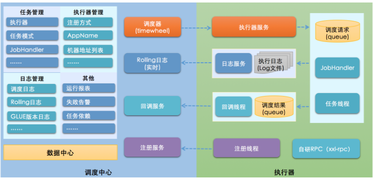
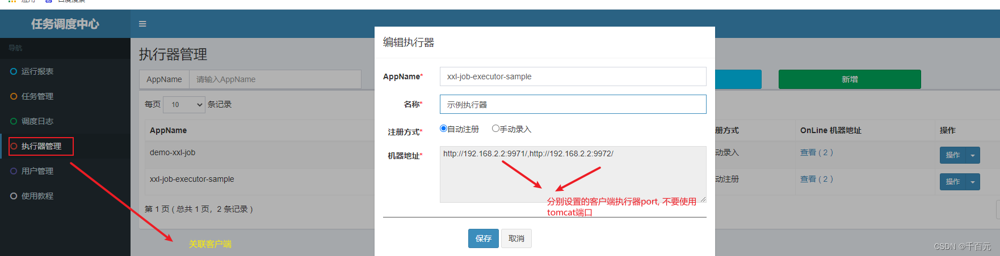
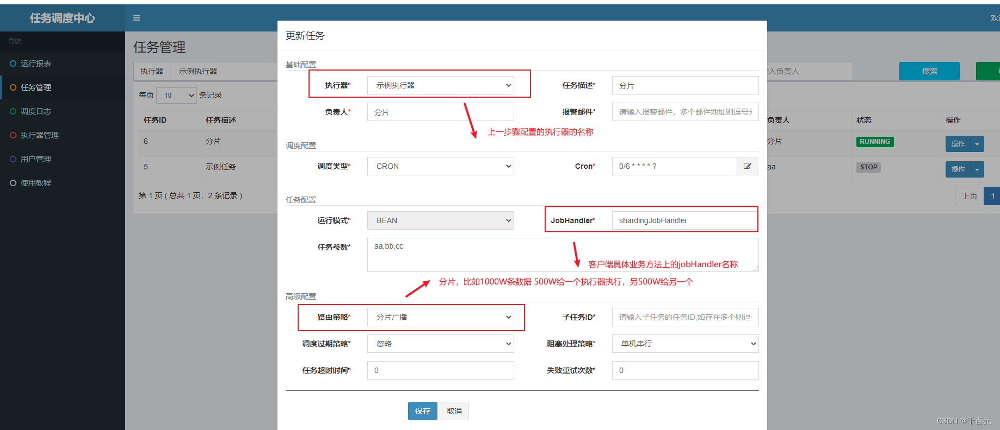
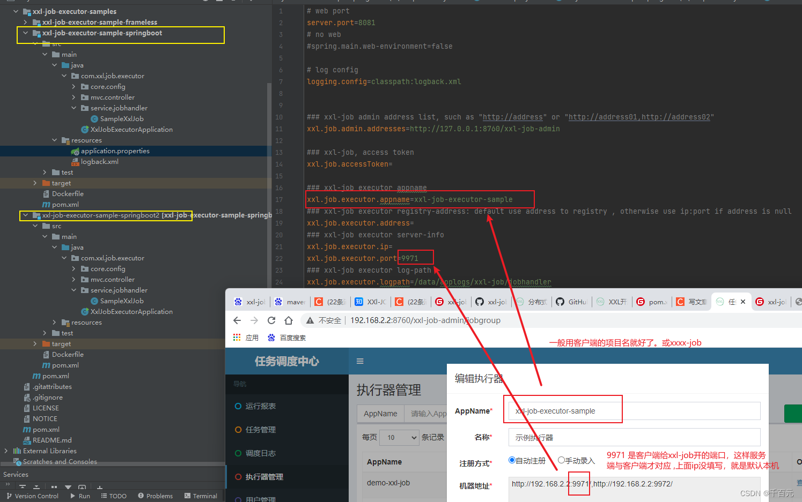
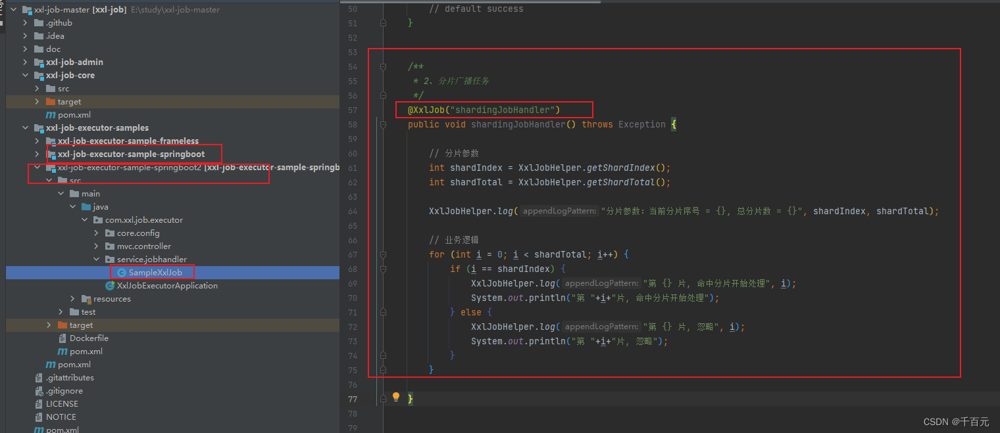
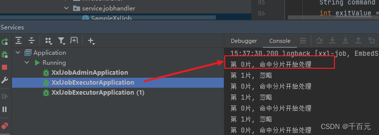

* 默认账号: admin   123456
* 框架：springboot+mybatis+freemarker
# 介绍
xxl-job则相反，是通过一个中心式的调度平台，调度多个执行器执行任务，调度中心通过DB锁保证集群分布式调度的一致性，这样扩展执行器会增大DB的压力，但是如果实际上这里数据库只是负责任务的调度执行。但是如果没有大量的执行器的话和任务的情况，是不会造成数据库压力的。实际上大部分公司任务数，执行器并不多(虽然面试经常会问一些高并发的问题)。

相对来说，xxl-job中心式的调度平台轻量级，开箱即用，操作简易，上手快，与SpringBoot有非常好的集成，而且监控界面就集成在调度中心，界面又简洁，对于企业维护起来成本不高，还有失败的邮件告警等等。这就使很多企业选择xxl-job做调度平台。

# pig中的job介绍
## lind-xxl-job-admin
这是xxl-job的管理平台，我们通过这个平台，来建立执行器和任务，及管理它们
## lind-common-job
这是需要接入的执行器项目需要引用它，通过它，我们可以简化项目介入xxl-job的步骤，你在配置文件添加xxl-admin地址和自己的appname之后，token是它们通讯的凭证，需要设置相同的值，最后开启注解`@EnableXxlJob`即可

# xxl-job架构图

# 例子

* 分片执行大任务

