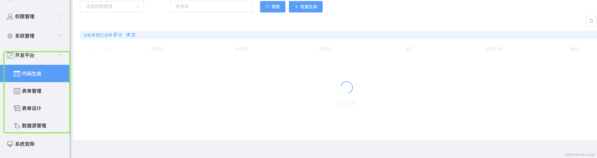
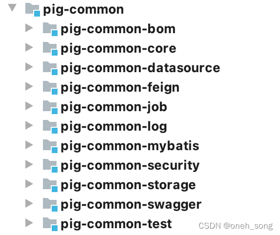

# 低代码框架
## 关于项目介绍和各模块关系
* lind-common
  * lind-common-core
  * lind-common-datasource
  * lind-common-feign
  * lind-common-job
  * lind-common-log
  * lind-common-mybatis
  * lind-common-security 安全组件，除了有一些认证与授权的注解外，还包含了feign调用biz服务的声明，对UserDetailsService里loadUserByUsername的实现等
  * lind-common-swagger
  * lind-dependency 整个项目的依赖包
* lind-common-service
  * lind-auth 认证服务，直接提供了简单的认证接口和界面，支持restFul方式的认证，直接返回token 
  * lind-xxl-job-admin 这是任务调度组件xxl-job的实现
  * lind-upms 系统管理模块
    * lind-upms-api 系统管理公开的接口和类
    * lind-upms-biz 系统管理系统
## feign请求带上token
* PigOAuthRequestInterceptor实现了RequestInterceptor拦截器，拦截feign的请求
* PigOAuthRequestInterceptor里注入BearerTokenResolver解析器，用来从header中将token解释出来
* PigOAuthRequestInterceptor中通过正则表达式，对token进行有效性校验

## starter包的说明
* META-INF/spring.factories  将需要自动注入的bean放到里面去
* META-INF/spring/org.springframework.boot.autoconfigure.AutoConfiguration.imports 和上面的文件功能一下，它更加直观
* META-INF/spring-devtools.properties ide中的任何打开的项目都会使用“restart”类加载器加载，任何常规.jar文件将使用“base”类加载器加载。 如果你在多模块项目上工作，但不是每个模块都导入到ide中，则可能需要自定义配置。 为此，你可以创建一个meta-inf/spring-devtools.properties文件,spring-devtools.properties文件可以包含restart.exclude. 和restart.include. 前缀的属性。 include元素是应该被放入“restart”类加载器的项目，exclude元素是应该放入“base”类加载器的项目
* META-INF/spring-configuration-metadata.json 在引用starter包后，在开发人员的IDE工具使用个人编写的配置读取很有效的在application.properties或application.yml文件下完成提示。
* META-INF/additional-spring-configuration-metadata.json 这个是普通的配置信息注释
> 注意：上面说的两个源数据注释json文件，是在打出的jar包里的META-INF里出现，在源项目中是没有的
```
<dependency>
  <groupId>org.springframework.boot</groupId>
  <artifactId>spring-boot-configuration-processor</artifactId>
  <optional>true</optional>
</dependency>
```
不过，这里还有个前提，你在写配置属性类的时候，有好好写注释，那么自动提示就都会带上了,如下代码
```
@ConfigurationProperties("swagger")
public class SwaggerProperties {
 
    /**
     * 标题
     **/
    private String title = "";
    /**
     * 描述
     **/
    private String description = "";
}
```
## 1 关于项目结构和依赖包
> maven中避免重复发明轮子的方法，一种是继承，一种是引用。
* maven中配置引用关系的方法是，如果在`父项目`中使用它，应该将下面代码添加到<dependencyManagement>标记中，如果在`单独项目`中引用，直接使用下面代码即可
```
 <dependency>
    <groupId>org.springframework.boot</groupId>
    <artifactId>spring-boot-dependencies</artifactId>
    <version>${spring-boot.version}</version>
    <type>pom</type>
    <scope>import</scope>
 </dependency>
```
很简单，这样就引入一个pom文件，这样<dependencies>里面引入对接的包，spring-boot-dependencies中配置了<version>，所以不需要再声明<version>了
```
<groupId>org.springframework.cloud</groupId>
<artifactId>spring-cloud-starter-eureka-server</artifactId>
```
由于没有版本信息，就可以参考引入的pom文件的<dependencyManagement>里面的版本信息,就像maven继承方法似的，在父pom的<dependencyManagement>里，放入版本信息，在若干子pom里都省去版本信息了

* 核心依赖包项目lind-dependency：pom.xml里只声明依赖，dependencyManagement管理的依赖，在被引用的子项目里，按着需要引入

* 根项目lind-fast
    * dependencyManagement不仅会引用springboot,spring-cloud,alibaba-cloud的依赖包（POM包），而且还引用lind-dependency的依赖，相当于把lind-dependency里的依赖包import到了根项目，这样方便其它子项目按需引用它
    * dependency引用了所有子项目都会用到了包，这样子项目就不需要再引用了
    * build>pluginManagement中添加了共用的插件声明，在子项目中，可以直接按着需要引用它，子项目中直接使用groupId和artifactId就可以了

## 2 关于打包时记录当前git信息
Maven打包发布版本可能会遇到自己的提交不起作用的情况，排查比较困难，可能需要拉下服务器上包，反编译查看是否包含自己的提交记录。如果使用的是GIT作为SCM，可以使用 git-commit-id-plugin插件
该插件在打包时生产一个`git.properties`文件，里面记录本次git提交的信息
```
#Generated by Git-Commit-Id-Plugin
git.build.time=2022-07-28 09\:15\:53
git.build.version=1.0.0
git.commit.id=dc8103b5cf9d51d59169e0682e9990456a72f231
git.commit.id.abbrev=dc8103b
git.commit.id.describe=dc8103b-dirty
git.commit.id.describe-short=dc8103b-dirty
git.commit.message.full=update cache log
git.commit.message.short=update cache log
git.commit.time=2022-07-28 08\:58\:43
```
* 可以在父项目中添加这个插件，这样子项目也就具有了这个能力
```
  <!--打包jar 与git commit 关联插件-->
<plugin>
    <groupId>io.github.git-commit-id</groupId>
    <artifactId>git-commit-id-maven-plugin</artifactId>
    <version>${git.commit.plugin}</version>
    <executions>
        <execution>
            <id>get-the-git-infos</id>
            <goals>
                <goal>revision</goal>
            </goals>
            <phase>initialize</phase>
        </execution>
    </executions>
    <configuration>
        <failOnNoGitDirectory>false</failOnNoGitDirectory>
        <generateGitPropertiesFile>true</generateGitPropertiesFile>
        <!--因为项目定制了jackson的日期时间序列化/反序列化格式，因此这里要进行配置,不然通过management.info.git.mode=full进行完整git信息监控时会存在问题-->
        <dateFormat>yyyy-MM-dd HH:mm:ss</dateFormat>
        <includeOnlyProperties>
            <includeOnlyProperty>^git.build.(time|version)$</includeOnlyProperty>
            <includeOnlyProperty>^git.commit.(id|message|time).*$</includeOnlyProperty>
        </includeOnlyProperties>
    </configuration>
</plugin>
```
## 3 docker打包与推送
* docker.host 表示本地的docker主机,tcp走2375端口
* docker.registry 表示私服地址，本例使用harbor做为私服
```
<plugin>
    <groupId>io.fabric8</groupId>
    <artifactId>docker-maven-plugin</artifactId>
    <version>${docker.plugin.version}</version>
    <configuration>
        <!-- Docker本地主机 -->
        <dockerHost>${docker.host}</dockerHost>
        <!-- Docker 镜像私服-->
        <registry>${docker.registry}</registry>
        <!-- 认证信息-->
        <authConfig>
            <push>
                <username>${docker.username}</username>
                <password>${docker.password}</password>
            </push>
        </authConfig>
        <images>
            <image>
                <name>${docker.registry}/${docker.namespace}/${project.name}:${project.version}</name>
                <build>
                    <dockerFile>${project.basedir}/Dockerfile</dockerFile>
                </build>
            </image>
        </images>
    </configuration>
</plugin>
```
* 本地docker主机需要开启2375这个tcp端口
```
# 打开配置文件
vi /usr/lib/systemd/system/docker.service
# 添加2375端口
ExecStart=/usr/bin/dockerd -H tcp://0.0.0.0:2375 -H unix://var/run/docker.sock
# 重新加载配置文件并重启服务
systemctl daemon-reload
systemctl restart docker
```
* 通过plugins的docker插件，进行build和push即可，需要注意本地docker主机与私服之间需要进行daemon.json的配置
```
{
  "registry-mirrors": ["https://ay50ucm9.mirror.aliyuncs.com","http://f2d6cb40.m.daocloud.io"],
  "insecure-registries":["http://192.168.xx.xxx:8888"]
}
```
* maven推送
```
mvn clean package docker:stop docker:remove docker:build docker:run
# 或者直接打包推送：mvn docker:build docker:push
```
* 输出
```
[INFO] --- docker-maven-plugin:0.40.1:push (default-cli) @ lind-fast-demo ---
[INFO] DOCKER> The push refers to repository [192.168.60.137:8888/lind-fast/lind-fast-demo]
edf103f27075: Preparing   
9f6bd6be39e5: Preparing   
d3f8c53ca74a: Preparing   
f9a0984f718a: Preparing   
2104e5b926f6: Preparing   
50644c29ef5a: Preparing   
50644c29ef5a: Waiting     
edf103f27075: Pushing     [>                                                  ]     512B/26.28kB
9f6bd6be39e5: Pushing      2.048kB
edf103f27075: Pushing     [==================================================>]  28.67kB
2104e5b926f6: Mounted from moxm/java 
d3f8c53ca74a: Mounted from moxm/java 
f9a0984f718a: Mounted from moxm/java 
edf103f27075: Pushed      
9f6bd6be39e5: Pushed      
50644c29ef5a: Mounted from moxm/java 
[INFO] DOCKER> 1.0.0: digest: sha256:47e560ca99e91aa73770a86991f68167510724d8a1da2820d8d3e24f64c85ddd size: 1575
[INFO] DOCKER> Temporary image tag skipped. Target image '192.168.60.137:8888/lind-fast/lind-fast-demo:1.0.0' already has registry set or no registry is available
[INFO] DOCKER> Pushed 192.168.60.137:8888/lind-fast/lind-fast-demo:1.0.0 in 3 seconds 
```
* 其它问题
如果你的docker:build失败，提示你的基础镜像不存在，我们可以把基础镜像添加到harbor中，模拟成为harbor中的镜像就可以了

# pig介绍
* 源码下载：https://gitee.com/log4j/pig
* 项目组件：nacos(服务注册与发现，配置中心)、gateway （业务网关）、loadBalancer(负载均衡)、Sentinel （限流、降级和熔断）、openfeign(服务调用)
> 项目分了多个服务，其中固定四个服务分别是： pig-register，pig-gateway，pig-auth，pig-upms ，pig-common 这也是项目启动顺序.

## 一、pig-register
此服务主要是模块启动配置类，以及nacos服务相关接口。
Nacos 承担整个 Spring Cloud 的服务发现、配置管理部分的实现。 是整个开发过程中强依赖，启动微服务业务要去检查 Nacos Server 是否已经启动，解压安装的方式变的非常不便
1、启动类
```

/**
 * @author nacos
 * <p>
 * nacos console 源码运行，方便开发 生产从官网下载zip最新版集群配置运行
 */
@Slf4j
@EnableScheduling 
@SpringBootApplication
public class PigNacosApplication {

	public static void main(String[] args) {
		if (initEnv()) {
			SpringApplication.run(PigNacosApplication.class, args);
		}
	}

	/**
	 * 初始化运行环境
	 */
	private static boolean initEnv() {
		System.setProperty(ConfigConstants.STANDALONE_MODE, "true");
		System.setProperty(ConfigConstants.AUTH_ENABLED, "false");
		System.setProperty(ConfigConstants.LOG_BASEDIR, "logs");
		System.setProperty(ConfigConstants.LOG_ENABLED, "false");
		System.setProperty("server.port","9527");
		return true;
	}

}
```
看此启动类运行即可启动，并且会初始化运行环境，包括
```
String AUTH_ENABLED = “nacos.core.auth.enabled” //是否开启认证
String LOG_BASEDIR = “server.tomcat.basedir” //日志目录
String LOG_ENABLED = “server.tomcat.accesslog.enabled” //access_log日志开关
```

2、配置类ConsoleConfig
这个配置类在程序启动的时候，会把naming、console（自身）和config下server包的 相关接口 都缓存到了“ControllerMethodsCache”的一个map中。

* HealthController（console健康信息）：检测Nacos是否正常
* NamespaceController（命名空间服务）：命名空间查询、创建和删除编辑
* PermissionController（权限操作相关）：根据角色查询、新增和删除权限
* RoleController（角色操作相关）、
* UserController（用户相关）
* ServerStateController（nacos服务状态）：获取nacos服务的standalone_mode、function_mode和version等信息
* CatalogController：根据命名空间id和服务名称查询服务详情和服务对应的集群信息
* ClusterController（集群信息相关）：更新集群信息，底层使用到了consistency模块
* InstanceController：实例注册、更新、移除和心跳检测
* ConfigController(软负载客户端发布数据专用控制器)：订阅或配置的客户端信息

## 二、pig-gateway
微服务架构存在多个服务项目，在项目开发中不可能让前端不停置换调用服务和接口，所以和出现了网关组件，保证前端直接调用网关可以分配到对应的服务接口。
网关不止提供对外统一接口，而且还可以做统一流量控制、熔断降级等处理，通过路由和过滤器配置作用所有的微服务。
网关三大核心：路由、断言和过滤

* 路由：构建网关的基本模块，由ID、目标URI、一系列断言和过滤器组成，断言为true则匹配该路由；
* 断言：开发人员匹配http请求中的所有内容；
* 过滤：过滤器的生命周期只有两个：pre和post
```
    pre：参数考验、权限校验、流量监控、日志输出、协议转换
    post：响应内容、响应头修改、日志输出、流量监控
    过滤器从从作用范围可分为两种：GatewayFilter 与 GlobalFilter；
    局部过滤器（GatewayFilter），是针对单个路由的过滤器。可以对访问的URL过滤，进行切面处理；
    全局过滤器（GlobalFilter）作用于所有路由，Spring Cloud Gateway 定义了Global Filter接口，用户可以自定义实现自己的Global Filter。通过全局过滤器可以实现对权限的统一校验，安全性验证等功能，并且全局过滤器也是程序员使用比较多的过滤器。
``` 
配置下：
```yml
cloud:
    gateway:
      locator:
        enabled: true
      routes:
        # 认证中心
        - id: pig-auth
          uri: lb://pig-auth
          predicates:
            - Path=/auth/**
          filters:
            # 验证码处理
             - ValidateCodeGatewayFilter
            # 前端密码解密
             - PasswordDecoderFilter
        #UPMS 模块
        - id: pig-upms-biz
          uri: lb://pig-upms-biz
          predicates:
            - Path=/admin/**
          filters:
            # 限流配置
            - name: RequestRateLimiter
              args:
                key-resolver: '#{@remoteAddrKeyResolver}' //使用SpEL按名称引用bean
                redis-rate-limiter.replenishRate: 100 //允许用户每秒处理多少个请求
                redis-rate-limiter.burstCapacity: 200 //令牌桶的容量，允许在一秒钟内完成的最大请求数
```
## 三、pig-auth
主要用来处理授权服务，用户前后端分离，实现用户登陆，获取token，用户授权配置。
用户登陆成功和失败会做对应的处理，发送日志
```
public class PigAuthenticationSuccessEventHandler extends AbstractAuthenticationSuccessEventHandler {

/**
 * 处理登录成功方法
 * <p>
 * 获取到登录的authentication 对象
 * @param authentication 登录对象
 */
@Override
public void handle(Authentication authentication) {
	log.info("用户：{} 登录成功", authentication.getPrincipal());
	SecurityContextHolder.getContext().setAuthentication(authentication);
	SysLog logVo = SysLogUtils.getSysLog();
	logVo.setTitle("登录成功");
	// 发送异步日志事件
	Long startTime = System.currentTimeMillis();
	Long endTime = System.currentTimeMillis();
	logVo.setTime(endTime - startTime);
	logVo.setCreateBy(authentication.getName());
	logVo.setUpdateBy(authentication.getName());
	SpringContextHolder.publishEvent(new SysLogEvent(logVo));
}


public class PigAuthenticationFailureEventHandler extends AbstractAuthenticationFailureEventHandler {

	/**
	 * 处理登录失败方法
	 * <p>
	 * @param authenticationException 登录的authentication 对象
	 * @param authentication 登录的authenticationException 对象
	 */
	@Override
	public void handle(AuthenticationException authenticationException, Authentication authentication) {
		log.info("用户：{} 登录失败，异常：{}", authentication.getPrincipal(), authenticationException.getLocalizedMessage());
		SecurityContextHolder.getContext().setAuthentication(authentication);
		SysLog logVo = SysLogUtils.getSysLog();
		logVo.setTitle("登录失败");
		logVo.setType(LogTypeEnum.ERROR.getType());
		logVo.setException(authenticationException.getMessage());
		// 发送异步日志事件
		Long startTime = System.currentTimeMillis();
		Long endTime = System.currentTimeMillis();
		logVo.setTime(endTime - startTime);
		logVo.setCreateBy(authentication.getName());
		logVo.setUpdateBy(authentication.getName());
		SpringContextHolder.publishEvent(new SysLogEvent(logVo));
	}

```
## 四、pig-upms
用户登陆后，用户、菜单和角色权限管理，实现用户模块的开发服务，用户还可以进入开发平台模块直接生成controller，service代码和mybatisPlus xml

## 五、pig-common：
系统共用模块，里面包含了 公共工具类核心包core、数据源datasource、feign调用、定时任务job、日志服务log、mybaticsPlus、安全工具类security、swagger使用

以上就为此次源码最重要的几个模块，框架复杂度主要在启动上，每次都要依次把pig-register，pig-gateway，pig-auth，pig-upms 服务的application启动起来。
但是项目的代码封装都很好用，满足大部门的需求，而且测试工具swagger也很好用，可直接找到接口做联调。
代码中最常用到的就是查询LambdaQueryWrapper,可直接做in,notIn，like,和orderBY等操作的数据，例如：
```
LambdaQueryWrapper<Guest> guestWrapper=Wrappers.lambdaQuery();
if(StringUtils.isNotBlank(name)){
    guestWrapper.like(Guest::getName,name);
}
if(StringUtils.isNotBlank(phone)){
    guestWrapper.eq(Guest::getPhone,phone);
}
guestWrapper.in(Guest::getId,Arrays.asList(111,222));
guestWrapper.orderByDesc(Guest::getSort);
aaService.list(guestWrapper);
```
因为封装方法默认做了为空不做处理的操作，所以对于编辑数据为空的操作可以使用 UpdateWrapper,如下：
```
UpdateWrapper<Station> stationWrapper=new UpdateWrapper<>();		 	 
stationWrapper.lambda().eq(Station::getId,id);	
stationWrapper.set("place",place);
stationWrapper.set("number",null);
boolean flag=stationService.update(pickRecordWrapper);

```
# 版本升级说明
> lind-fast模块包括了lind-common,lind-common-service的子模块，它们的版本号统一；而插件类lind-plugin组件和子组件版本号统一；这两块部署需要分开进行。
* 命令行执行 mvn versions:set -DnewVersion=1.5.3 //更新了hbase的update，如果不存在，不去插入新数据
* 提交 mvn versions:commit //提交，删除多余的pom.xml.versionsBackup
* mvn deploy根项目

